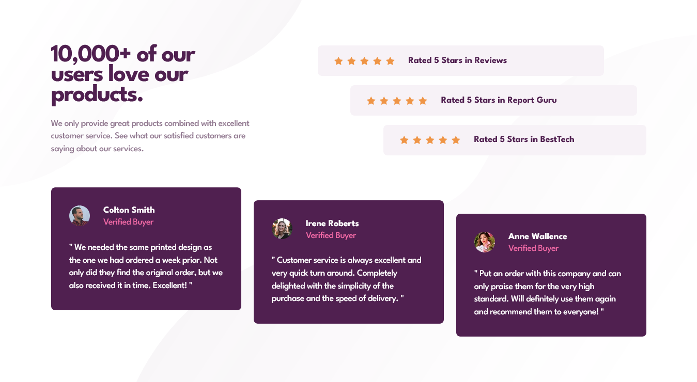

# Frontend Mentor - Social proof section solution

This is a solution to the [Social proof section challenge on Frontend Mentor](https://www.frontendmentor.io/challenges/social-proof-section-6e0qTv_bA). Frontend Mentor challenges help you improve your coding skills by building realistic projects.

## Table of contents

- [Overview](#overview)
  - [The challenge](#the-challenge)
  - [Screenshot](#screenshot)
  - [Links](#links)
- [My process](#my-process)
  - [Built with](#built-with)
  - [What I learned](#what-i-learned)
- [Author](#author)

## Overview

### The challenge

Users should be able to:

- View the optimal layout for the section depending on their device's screen size

## Screenshot

### Mobile Screenshot


### Desktop Screenshot



### Links

- Live Site URL: [Social proof section](https://social-proof-sectionproject.nelify.app)

## My process

### Built with

- Semantic HTML5 markup
- CSS custom properties
- Flexbox
- CSS Grid
- Mobile-first workflow
- Animation

### What I learned

I learnt that it's possible to fix in 2 images in **background-image** property and also control both their position with **background-position**;

Here is the code snippets below:

```css
.class{
  background-image: url("image1"), url("image2");
  background-position: x-axis y-axis, x-axis y-axis;
}
```

I learnt that **padding-inline** has 2 values input and also, **padding-block**? 🤔 hmmm...
Yeah it does 😅

Here is the code snippets below:

```css
.class {
  padding-inline: 12rem 7rem; /*This both indicating padding left and right respectively*/
}
```

## Author

- Website - [CodeStan Portfolio](https://codestan.netlify.app/)
- Frontend Mentor - [@code-stan](https://www.frontendmentor.io/profile/code-stan)
- Twitter - [@Codestanley](https://www.twitter.com/codestanley)
